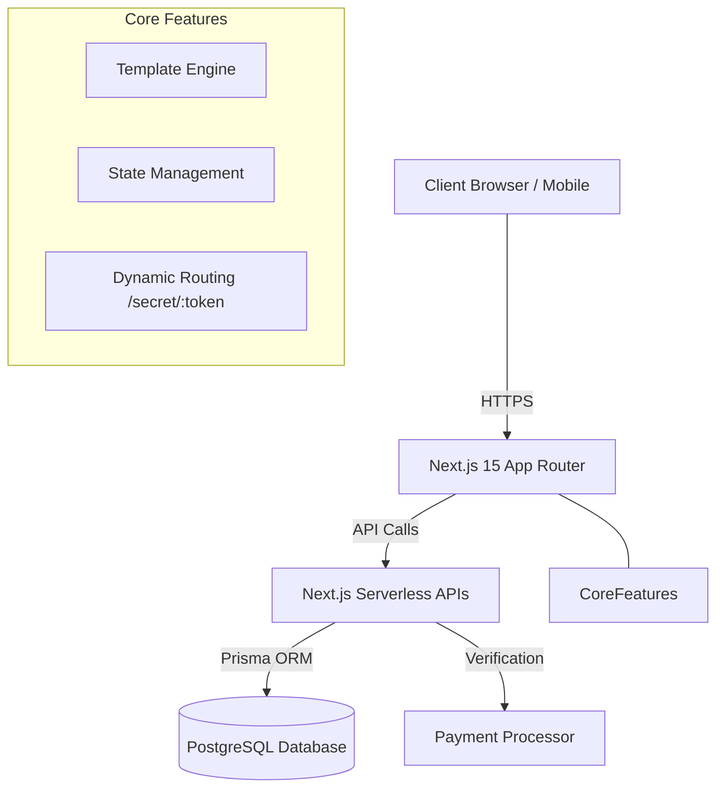

# Purpose 💘 - Interactive Digital Proposal SaaS

An end-to-end Full-Stack SaaS platform that allows users to create highly interactive, cinematic, and personalized digital proposal experiences (web pages). Designed with a focus on seamless user experience, secure payment gateways, and scalable architecture.

## 📝 1. Clear Explanation
* **The Problem:** People want unique, memorable ways to propose or express feelings digitally, but lack coding skills to build interactive, cinematic web experiences.
* **The Solution:** A SaaS platform offering no-code, drag-and-drop style customization of premium interactive templates with integrated background scores and VFX.
* **Implementation:** Built using Next.js for SSR/SSG, Prisma + PostgreSQL for robust relational data management, and Framer Motion for 60fps cinematic animations.
* **The Result:** A highly converting, visually stunning platform where users can generate secure, shareable secret links in under 2 minutes.

## 🏗️ 2. Architecture Diagram

## 💻 3. Tech Stack
* **Frontend:** React.js, Next.js 15, Tailwind CSS, Framer Motion
* **Backend:** Next.js API Routes (Node.js edge/serverless)
* **Database:** PostgreSQL, Prisma ORM
* **Language:** TypeScript

## 🔐 4. Security Considerations
* **Cryptographic Tokens:** URLs are generated using secure, unique hashes (CUID) to prevent IDOR (Insecure Direct Object Reference) and enumeration attacks.
* **Payment Validation:** Server-side validation of transactions before activating the live URL.
* **Content Protection:** Custom overlays and disabled right-click functions to protect premium assets.

## ⚠️ 5. Error Handling
* **Graceful Degradation:** Fallback UI components (e.g., Expired/Invalid link pages).
* **Robust API Responses:** Standardized JSON error payloads `({ success: false, error: "Reason" })` mapped to frontend toast notifications/modals.

## 🔌 6. Database & APIs
* **Relational Schema:** Prisma schema ensures strict data typing and relations between Transactions, Customers, and generated Proposals.
* **RESTful Endpoints:** Secure POST/GET endpoints for data mutation and retrieval.

## 🧪 7. Tests (Implementation Strategy)
* Codebase is structured to support **Jest** for unit testing API route logic and **Playwright** for End-to-End (E2E) testing of the creation pipeline.

## 🚀 8. Deployment
* Optimized for **Vercel** (Frontend & APIs) and **Neon/Supabase** (PostgreSQL).
